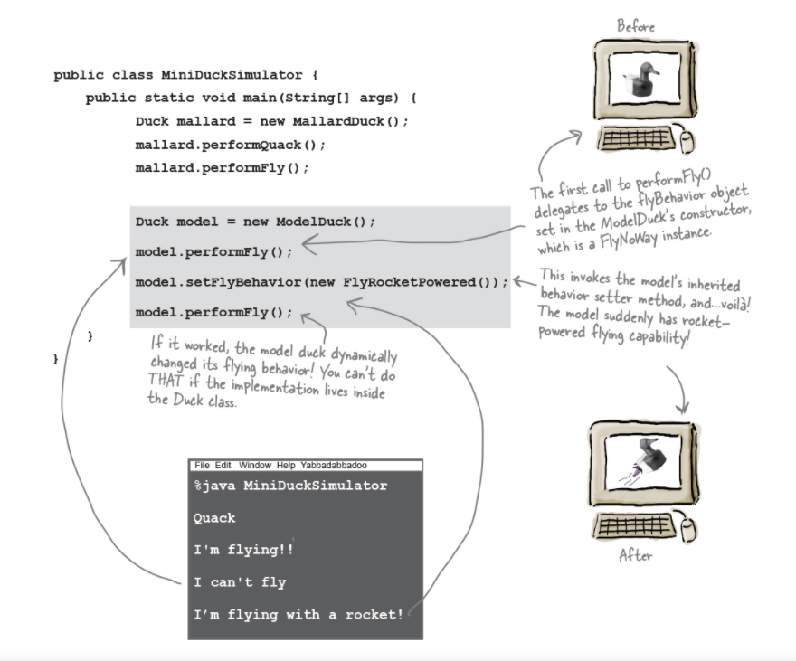

# Strategy Pattern

The problem is how to extend the behaviors of a superclass to a set of subclasses alike, but each subclass could have differences?

Initially you might think using _Inheritance_, you could have a superclass _Duck_ and the different kinds of ducks inheriting the attributes and behaviors. You may find attributes and behaviors that do not change across different kinds of ducks and some that may vary. For example, all ducks swim, but not all can fly or quack, or they quack differently. By using inheritance you would have to override the `fly()` and `quack()` methods for every kind of ducks.

Could you define an interface, and let only ducks that fly or quack implement the interfaces? It could work, however if you want to make any changes in the `Fly()` or `Quack()` interfaces, then you would have to update every implementation of the interface.

In sum, you have some methods/behavior that changes, and to maintain the code is very difficult and prone to errors.

The trick is to _encapsulate_ these methods (things that varies), so it won't affect the rest of the code.

The `Strategy Pattern` defines a family of algorithms, encapsulates each one, and makes them interchangeable. `Strategy` lets the algorithm vary independently from clients that use it.

Instead of thinking of the duck behaviors as a *set of behaviors*, we'll start thinking of them as a *family of algorithms*. In this project, the algorithms represent things a duck would do (different ways of quacking or flying), but we could just use the same techniques for a set of classes that implement the way to compute sales tax by different states (Aniche has a example in his book).

Each duck has a **FlyBehavior** and a **QuackBehavior** to which delegates flying and quacking. When you put two classes together like this, your're using `Composition`. Instead of *inheriting* their behavior, the ducks get their behavior by being *composed* with the right behavior object.

From now on, the Duck behaviors will live in a separate class—a class that implements a particular behavior interface.

That way, the Duck classes won’t need to know any of the implementation details for their own behaviors.

We’ll use an interface to represent each behavior—for instance, FlyBehavior and QuackBehavior—and each implementation of a behavior will implement one of those interfaces.

With this design, other types of objects can reuse our fly and quack behaviors because these behaviors are no longer hidden away in our Duck classes!

And we can add new behaviors without modifying any of our existing behavior classes or touching any of the Duck classes that use flying behaviors.

So we get the benefit of REUSE without all the baggage that comes along with inheritance.

So MallardDuck’s quack is a real live duck quack, not a squeak and not a mute quack. So what happens here? When a MallardDuck is instantiated, its constructor initializes the MallardDuck’s inherited quackBehavior instance variable to a new instance of type Quack (a QuackBehavior concrete implementation class).And the same is true for the duck’s flying behavior—the MallardDuck’s constructor initializes the flyBehavior instance variable with an instance of type FlyWithWings (a FlyBehavior concrete implementation class).

Still, notice that while we are setting the behaviors to concrete classes (by instantiating a behavior class like Quack or FlyWithWings and assigning it to our behavior reference variable), we could easily change that at runtime.

### `Favor composition over inheritance`

Creating systems using composition gives you a lot mode flexibility. Not only does it let you encapsulate a family of algorithms into their own set of classes, but it also let you **change behavior at runtime** as long as the object you're composing with implements the correct behavior interface.

Credits:
Head First Design Patterns, 2nd Edition
*by Eric Freeman, Elisabeth Robson, Kathy Sierra, and Bert Bates*
