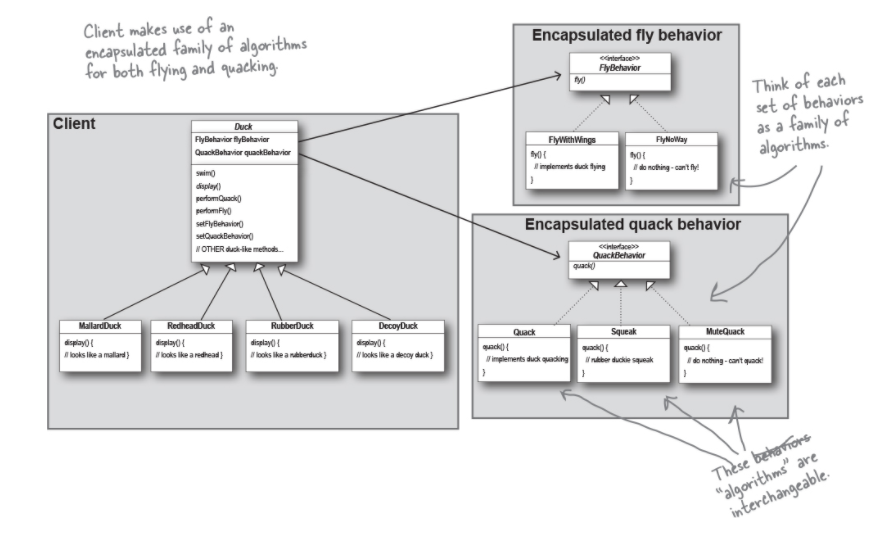
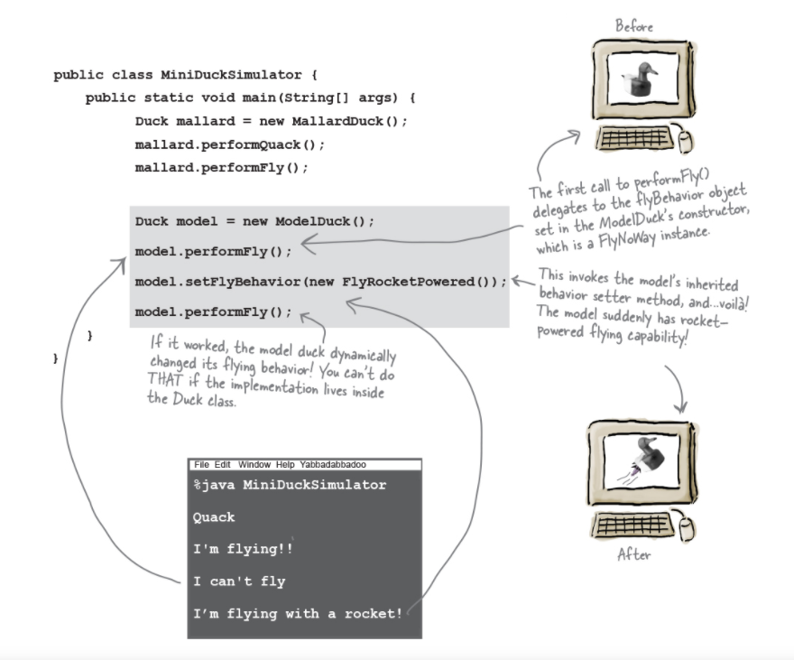

# Strategy Pattern

The `Strategy Pattern` defines a family of algorithms, encapsulates each one, and makes them interchangeable. `Strategy` lets the algorithm vary independently from clients that use it.

Instead of thinking of the duck behaviors as a *set of behaviors*, we'll start thinking of them as a *family of algorithms*. In this project, the algorithms represent things a duck would do (different ways of quacking or flying), but we could just use the same techniques for a set of classes that implement the way to compute sales tax by different states (Aniche has a example in his book).

Each duck has a **FlyBehavior** and a **QuackBehavior** to which delegates flying and quacking. When you put two classes together like this, your're using `Composition`. Instead of *inheriting* their behavior, the ducks get their behavior by being *composed* with the right behavior object.

### `Favor composition over inheritance`

Creating systems using composition gives you a lot mode flexibility. Not only does it let you encapsulate a family of algorithms into their own set of classes, but it also let you **change behavior at runtime** as long as the object you're composing with implements the correct behavior interface.

Credits:
Head First Design Patterns, 2nd Edition
*by Eric Freeman, Elisabeth Robson, Kathy Sierra, and Bert Bates*
